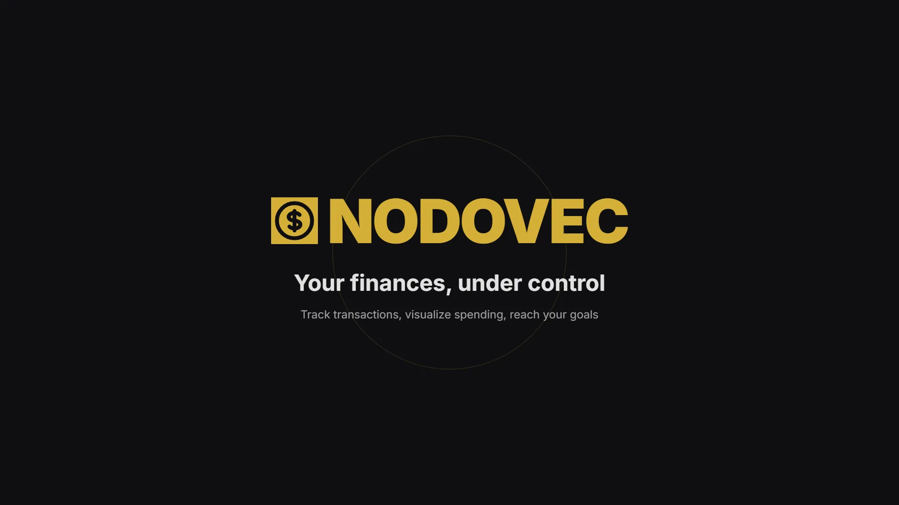
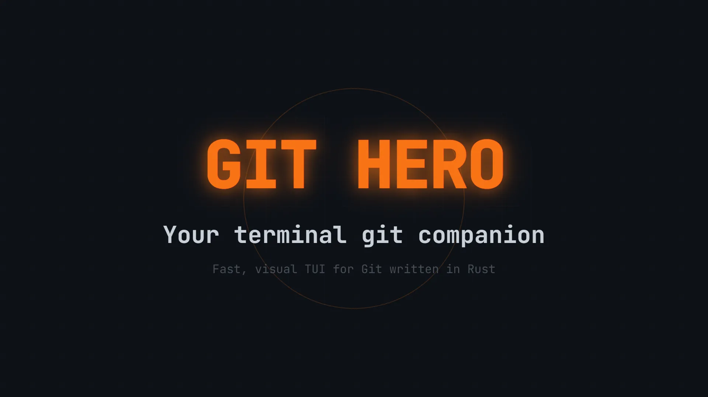
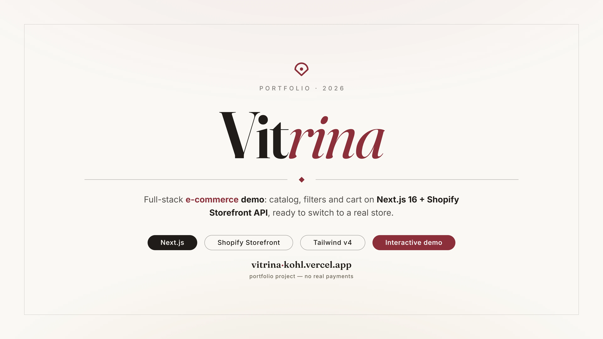

# Portfolio de Marlon Ramirez

Mi portafolio personal: un espacio sobrio, oscuro y bilingüe (ES/EN) donde muestro el software que construyo. No es una plantilla ni un template — es un proyecto vivo que uso para presentar mis herramientas y productos de forma honesta: qué hacen, con qué están hechos y una demo real de cada uno.

## Stack

- **Next.js 16** (App Router) + **React 19** + **TypeScript**
- **Tailwind CSS v4** — tema oscuro exclusivo, tokens en `globals.css`
- **Framer Motion** — animaciones y micro-interacciones
- **next-intl** — internacionalización español/inglés con enrutado por locale
- **OpenNext + Cloudflare Workers** — build y despliegue serverless
- **lucide-react**, **clsx**, **tailwind-merge** — iconografía y utilidades de clases

## Estructura del código

```
src/
├── app/          # Rutas con layout por locale ([locale]/)
├── components/   # UI, layout y secciones
├── data/         # projects.ts — fuente de verdad de los proyectos
└── i18n/         # Config y mensajes ES/EN
```

## Proyectos destacados

### NodoVec

Software de gestión financiera personal con dashboard analytics, gestión de tarjetas de crédito, compras a cuotas, multi-moneda y ocho temas visuales.



<video src='public/videos/projects/nodovec-promo.webm' controls width='760' loop>
  Tu navegador no soporta video — <a href='public/videos/projects/nodovec-promo.webm'>ver promo de NodoVec (.webm)</a>
</video>

- Stack: Astro 5, React, Tailwind CSS v4, Laravel 12, MySQL, Kubernetes
- En producción · [Repositorio](https://github.com/MarlonRX/nodovec_frontend) · [Demo en vivo](https://nodovec-web-production.up.railway.app)

### Git Hero

TUI rápida y visual para gestionar Git, escrita en Rust con Ratatui. Alternativa moderna a lazygit y gitui con dashboard interactivo, 10 temas, soporte i18n y modo CLI.



<video src='public/videos/projects/git-hero-promo.webm' controls width='760' loop>
  Tu navegador no soporta video — <a href='public/videos/projects/git-hero-promo.webm'>ver promo de Git Hero (.webm)</a>
</video>

- Stack: Rust, Ratatui, Crossterm
- En producción · [Repositorio](https://github.com/MarlonRX/git-hero)

### Vitrina

Demo de e-commerce full-stack con catálogo, filtros y carrito sobre Next.js 16 y la Shopify Storefront API, lista para conmutar a una tienda real.



<video src='public/videos/projects/vitrina-promo.webm' controls width='760' loop>
  Tu navegador no soporta video — <a href='public/videos/projects/vitrina-promo.webm'>ver promo de Vitrina (.webm)</a>
</video>

- Stack: Next.js 16, Shopify Storefront API, Hydrogen React, Tailwind CSS v4, next-intl
- En producción · [Repositorio](https://github.com/MarlonRX/vitrina) · [Demo en vivo](https://vitrina-kohl.vercel.app)

## Correrlo localmente

```bash
npm install
npm run dev        # servidor de desarrollo en http://localhost:3000
```

Otros scripts útiles:

```bash
npm run build      # build de producción
npm run lint       # ESLint
npm run preview    # build OpenNext + preview local en Cloudflare (wrangler)
```

## Despliegue

El sitio se despliega en **Cloudflare Workers** vía **OpenNext** (`@opennextjs/cloudflare`), con configuración en `open-next.config.ts` y `wrangler.jsonc`:

```bash
npm run deploy     # opennextjs-cloudflare build && opennextjs-cloudflare deploy
```

Necesitas sesión activa de Wrangler (`wrangler login`) con acceso a la cuenta de Cloudflare donde vive el worker `portfolio`. Las variables/secretos del entorno se gestionan desde el dashboard de Cloudflare.

---

Hecho por Marlon Ramirez · [GitHub](https://github.com/MarlonRX)
